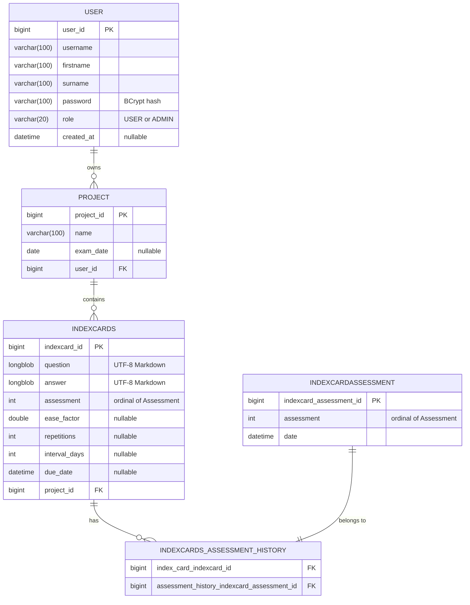

# Database

The application uses MySQL 5.7. The entities are in `indexcards/src/main/java/com/x7ubi/indexcards/models`.

## ER-Diagram

## Tables

### user

A user account. The username is unique (checked by the application), the password is stored as a BCrypt hash.
`role` is `USER` or `ADMIN` (stored as text); admins can open the [analytics](user-guide/admin.md) page.
`created_at` is the signup date; it is `null` for accounts created before migration 4.

### project

A project of a user. The name is unique per user (checked by the application). `exam_date` is optional and used for
[spaced repetition](development/spaced-repetition.md#exam-date).

### indexcards

An index card of a project.

- `question` and `answer` are stored as `longblob` (`byte[]` in the entity) containing UTF-8 text. They are converted
  to strings in `IndexCardMapper`.
- `assessment` is the latest rating of the card.
- `ease_factor`, `repetitions`, `interval_days` and `due_date` hold the [spaced repetition](development/spaced-repetition.md)
  state. They are `NULL` for cards that were never rated; the entity then returns the defaults (ease factor 2.5,
  0 repetitions, interval 0, due now).

### indexcardassessment / indexcards_assessment_history

Every rating of a card is saved as an `indexcardassessment` row with its date. The join table
`indexcards_assessment_history` links the ratings to the card.

## Assessment

`Assessment` is an enum with the values `UNRATED`, `BAD`, `OK` and `GOOD`. It is stored as its **ordinal**
(`0`–`3`).

!!! danger
    Never reorder or insert values into the `Assessment` enum. Since the ordinal is stored, this would change the
    meaning of all existing ratings. New values may only be appended at the end, and the frontend enum in
    `app.responses.ts` must be kept in the same order.

## Deleting

Deletes cascade through the entities: deleting a user deletes their projects, deleting a project deletes its index
cards, deleting an index card deletes its rating history. Images are not stored in the database; see
[Backend](development/backend.md#images) for how they are deleted.

## Migrations

The schema is managed with [Flyway](https://flywaydb.org/). Migrations are in
`indexcards/src/main/resources/db/migration` and run automatically when the backend starts. Hibernate only validates
that the schema matches the entities (`spring.jpa.hibernate.ddl-auto=validate`), so the backend does not start if they
differ.

| Version | File                               | Description                                                                          |
|---------|------------------------------------|--------------------------------------------------------------------------------------|
| 1       | `V1__baseline.sql`                 | Initial schema, as previously generated by Hibernate.                                |
| 2       | `V2__drop_legacy_join_tables.sql`  | Moves links from the old join tables `user_projects` / `project_index_cards` into the foreign keys and drops the tables. |
| 3       | `V3__project_archive.sql`          | Adds `archived` and `auto_archived_exam_date` to `project`.                          |
| 4       | `V4__user_role_created_at.sql`     | Adds `role` (default `USER`) and `created_at` to `user`.                              |

Databases that existed before Flyway was introduced are marked as version 1 (`spring.flyway.baseline-on-migrate`)
instead of running the baseline script.

To change the schema:

1. change the entity,
2. add a new migration `V<next>__<description>.sql` with the matching SQL,
3. never edit a migration that has already been deployed.

Tests use H2 and let Hibernate create the schema, so they do not run the migrations.
