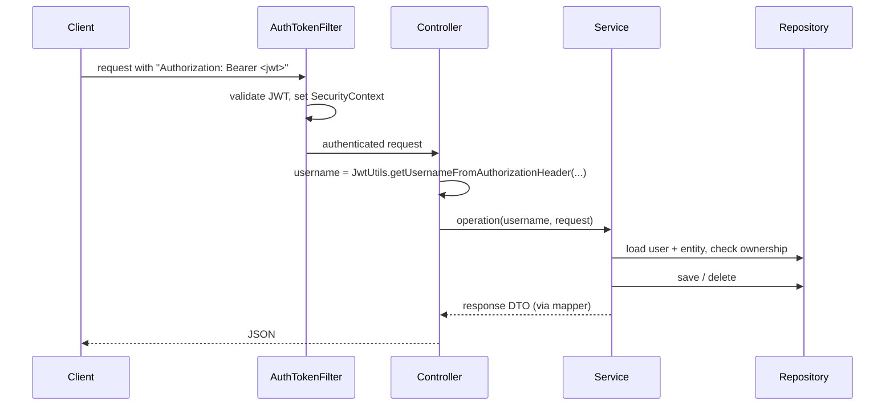

# Backend

The backend is a Spring Boot 4.1 application (Java 21) in `indexcards/`. The package root is `com.x7ubi.indexcards`.

## Packages

| Package       | Content                                                                                   |
|---------------|-------------------------------------------------------------------------------------------|
| `controller`  | REST controllers, one per resource (`/api/auth`, `/api/project`, `/api/indexCard`, ...).  |
| `service`     | Business logic, grouped by domain (`authentication`, `project`, `indexcard`, `image`, `user`). |
| `models`      | JPA entities (`User`, `Project`, `IndexCard`, `IndexCardAssessment`) and the `Assessment` enum. |
| `repository`  | Spring Data JPA repositories.                                                             |
| `request`     | Request DTOs, grouped by domain.                                                          |
| `response`    | Response DTOs, grouped by domain.                                                         |
| `mapper`      | MapStruct mappers between entities and DTOs (`ProjectMapper`, `IndexCardMapper`).         |
| `jwt`         | Creating and validating JWTs (`JwtUtils`) and the 401 entry point (`AuthEntryPointJwt`).  |
| `config`      | Spring Security, JWT filter, CORS and web configuration.                                  |
| `exceptions`  | Custom exceptions and the `GlobalExceptionHandler`.                                       |
| `error`       | `ErrorMessage` — the error codes returned to the frontend.                                |

## Request flow

### Controllers

Controllers are thin. They read the username from the `Authorization` header and delegate to a service. They never
return entities, only response DTOs.

### Services

Services are split **one per operation**, not one per entity. For example, index cards have `CreateIndexCardService`,
`EditIndexCardService`, `DeleteIndexCardService`, `IndexCardAssessmentService`, `IndexCardQuizService` and the
read-only `IndexCardService`.

All index card services extend `AbstractIndexCardService`, all project services extend `AbstractProjectService`.
These hold the shared repositories and guard methods such as `getUser(username)`, `getProjectNotFoundError(id)`,
`getIndexCardNotFoundError(id)` and `getProjectOwnerError(user, project)`.

When adding a new operation, add a new service extending the matching abstract service instead of growing an existing
one.

### Ownership checks

Nearly every operation follows the same pattern:

1. load the `User` by username,
2. load the target project or index card (throw `EntityNotFoundException` if it does not exist),
3. check that the project belongs to the user (throw `UnauthorizedException` otherwise),
4. perform the change.

## Error handling

Exceptions are translated into HTTP responses by `GlobalExceptionHandler`. The response body is a plain error code from
`ErrorMessage`, which the frontend translates (`backend.<code>` in the i18n files).

| Exception                  | Status | Example codes                                                  |
|----------------------------|--------|----------------------------------------------------------------|
| `EntityNotFoundException`  | 400    | `project_not_found`, `indexcard_not_found`, `image_not_found`, `username_not_found` |
| `EntityCreationException`  | 400    | `project_name_exists`, `project_name_too_long`, `invalid_image` |
| `UsernameExistsException`  | 400    | `username_exists`                                              |
| `UnauthorizedException`    | 401    | `user_not_project_owner`, `wrong_password`                     |
| `BadCredentialsException`  | 401    | `bad_credentials`                                              |
| any other exception        | 500    | `Internal server error`                                        |

When adding a new error, add the code to `ErrorMessage` and a translation under `backend` in
`indexcards-ui/src/assets/i18n/*.json`.

## Authentication

Authentication is stateless with JWTs:

- `POST /api/auth/login` checks the credentials with Spring Security's `AuthenticationManager` and returns a JWT
  signed with HS512. Tokens expire after 24 hours (`bezkoder.app.jwtExpirationMs`).
- `AuthTokenFilter` validates the token of every request and sets the security context.
- Passwords are hashed with BCrypt.
- `SecurityConfig` permits `/api/auth/**`, `/api/test/**` and `GET /api/images/**` without authentication; everything
  else requires a valid token. Unauthenticated requests get a `401` from `AuthEntryPointJwt`.

The signing key is read from `JWT_SECRET` (see [configuration](../operations/deployment.md#configuration)).

## Index card content

Question and answer are stored as `byte[]` (`@Lob`, `longblob` in MySQL) in the `IndexCard` entity and converted
to and from UTF-8 strings in `IndexCardMapper`. There is no length limit. The content is Markdown with LaTeX; the backend
does not interpret it, except when deleting a user (see below).

## Images

`ImageStorageService` stores uploaded images as `<uuid>.jpg` in the directory configured by
`app.images.storage-path`. Only files with an `image/*` content type are accepted, and uploads are limited to 5 MB.

Images are **not** linked to users or cards in the database. Cards reference them in their Markdown as
`/api/images/<uuid>`. When a user deletes their account, `DeleteUserService` scans the user's cards for these
references and deletes the image files after the database transaction was committed, skipping images that are still
referenced by cards of other users.

## Spaced repetition

Scheduling is implemented in `SpacedRepetitionScheduler`. See [Spaced Repetition](spaced-repetition.md).

## Tests

Tests are in `indexcards/src/test`, grouped like the services (`indexcard`, `project`, `user`, `image`, `jwt`). They use
JUnit 5 with an in-memory H2 database configured in `TestConfig.java` and the `*TestConfig.java` classes of each
feature.
