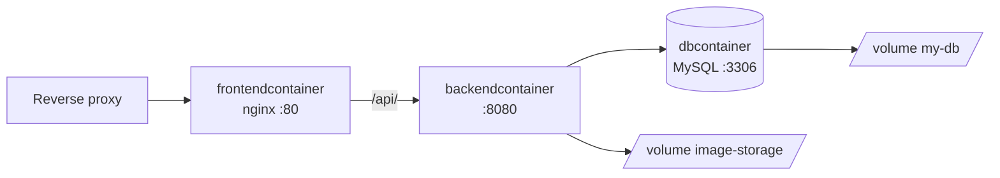

# Deployment

The application is deployed with Docker Compose using `docker-compose.yml` in the repository root. The
[pipeline](../pipeline.md#deployment) does this automatically on every push to `main`.

## Containers

| Service    | Container           | Image / Build                  | Port (host:container) | Description                          |
|------------|---------------------|--------------------------------|-----------------------|--------------------------------------|
| `mysqldb`  | `dbcontainer`       | `mysql:5.7`                    | `3306:3306`           | Database `indexcardsdb`              |
| `backend`  | `backendcontainer`  | `indexcards/Dockerfile`        | `8081:8080`           | Spring Boot backend                  |
| `frontend` | `frontendcontainer` | `indexcards-ui/Dockerfile`     | `4200:80`             | Angular app served by nginx          |



- The **frontend** image builds the Angular app with Node and serves it with nginx (`indexcards-ui/nginx.conf`).
  nginx serves the app for all paths (falling back to `index.html` for client-side routing) and forwards `/api/` to
  `backendcontainer:8080`.
- The **backend** image builds the jar with Maven and runs it on Java 21.
- The frontend and backend are also attached to the external network `nginx_backend`, which is used by the reverse
  proxy on the server. It has to exist before starting: `docker network create nginx_backend`.

### Volumes

| Volume          | Mounted at               | Content                          |
|-----------------|--------------------------|----------------------------------|
| `my-db`         | `/var/lib/mysql`         | MySQL data                       |
| `image-storage` | `/app/data/images`       | Uploaded images of index cards   |

Both volumes must be included in backups.

### Logging

All containers use the `json-file` log driver with at most 3 files of 10 MB each, so logs (including nginx access logs
with IP addresses) are rotated automatically.

## Configuration

The backend is configured in `indexcards/src/main/resources/application.properties`. Values can be overridden with
environment variables.

| Environment variable           | Default                                  | Description                                                   |
|--------------------------------|------------------------------------------|---------------------------------------------------------------|
| `DB_PASSWORD`                  | —                                        | Used by Docker Compose as MySQL root password and for the backend. |
| `JWT_SECRET`                   | random key per start                     | Base64-encoded HS512 key (≥ 64 bytes) for signing tokens.     |
| `SPRING_DATASOURCE_URL`        | `jdbc:mysql://${MYSQL_HOST:localhost}:3306/indexcardsdb` | Database URL.                          |
| `SPRING_DATASOURCE_USERNAME`   | `root`                                   | Database user.                                                |
| `SPRING_DATASOURCE_PASSWORD`   | `12345678`                               | Database password.                                            |
| `MYSQL_HOST`                   | `localhost`                              | Database host (if `SPRING_DATASOURCE_URL` is not set).        |
| `IMAGES_STORAGE_PATH`          | `./data/images`                          | Directory for uploaded images.                                |
| `DEFAULT_ADMINS`               | — (`7ubi` in Docker Compose)             | Comma-separated usernames made admins on every start, see [Creating an admin](#creating-an-admin). |
| `AI_KEY_ENCRYPTION_SECRET`     | — (feature disabled)                     | Base64-encoded 32-byte key that encrypts users' Gemini API keys, see [AI card generation](#ai-card-generation). |
| `AI_MODEL`                     | `gemini-3.8-flash`                       | Gemini model used for card generation.                        |
| `AI_THINKING_LEVEL`            | `low`                                    | Gemini 3 thinking level (`low`, `medium`, `high`); empty uses the model default. Not sent to Gemini 2.x models. |

Other settings in `application.properties`:

| Property                                   | Value      | Description                        |
|--------------------------------------------|------------|------------------------------------|
| `bezkoder.app.jwtExpirationMs`             | `86400000` | Token lifetime (24 hours).         |
| `spring.servlet.multipart.max-file-size`   | `10MB`     | Maximum size of an uploaded file (PDFs for AI generation; images are limited to 5 MB in code). |
| `spring.servlet.multipart.max-request-size`| `11MB`     | Maximum size of a multipart request. |

!!! warning
    Always set `JWT_SECRET` in production. Without it a new random key is generated on every start and all users are
    logged out whenever the backend restarts. Generate a key with:

    ```bash
    openssl rand -base64 64 | tr -d '\n'
    ```

## AI card generation

[AI card generation](../user-guide/ai-generation.md) uses each user's own Gemini API key; the server has no API
key of its own. Saved keys are encrypted with AES-256-GCM using `AI_KEY_ENCRYPTION_SECRET`. Generate it once with

```bash
openssl rand -base64 32
```

and store it as the GitHub secret `AI_KEY_ENCRYPTION_SECRET` (the pipeline passes it to Docker Compose).

- Without the secret the feature is disabled and hidden in the frontend. A value that is not base64 or not 32 bytes
  long stops the backend from starting.
- **Never change or lose the secret.** Keys saved with another secret can no longer be decrypted; users then get
  `ai_api_key_unreadable` and have to save their key again.
- Generation requests upload PDFs of up to 10 MB and can take up to two minutes. `indexcards-ui/nginx.conf` allows
  this for `/api/` (`client_max_body_size 12m`, `proxy_read_timeout 300s`); the reverse proxy in front of the frontend
  needs the same limits.

## Deploying manually

```bash
export DB_PASSWORD=<database password>
export JWT_SECRET=<base64 key>
export AI_KEY_ENCRYPTION_SECRET=<base64 key>   # optional, enables AI card generation
docker-compose down
docker-compose up --build -d
```

Database migrations run automatically when the backend starts (see [Migrations](../database.md#migrations)).

## Creating an admin

Admins can open the [analytics page](../user-guide/admin.md). The usernames in `DEFAULT_ADMINS` (comma separated,
`7ubi` by default in `docker-compose.yml`) are made admins every time the backend starts. Usernames that do not exist
are skipped with a warning in the log; they are not reserved, so whoever signs up with such a name becomes an admin on
the next start. Set `DEFAULT_ADMINS=` (empty) in `.env` to turn this off.

After that, admins can make other users admins from the analytics page. Without a default admin, promote an existing
account in the database:

```bash
docker exec -it dbcontainer mysql -uroot -p indexcardsdb \
  -e "update user set role = 'ADMIN' where username = '<username>';"
```

Revoking the role is only possible in the database: set `role` back to `'USER'` (and remove the user from
`DEFAULT_ADMINS`, otherwise the next start makes them admin again). The role is read from the database on every request, so the change applies
immediately without logging in again.

## Documentation

The documentation has its own `indexcards-docu/docker-compose.yml`. It runs `mkdocs serve` on port `8005` in a Python
container attached to the external networks `nginx_frontend` and `nginx_backend`.

```bash
cd indexcards-docu
docker-compose up --build -d
```
