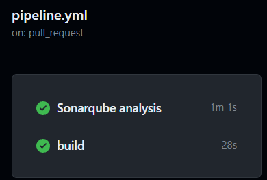

# Pipeline

The pipeline is a GitHub Actions workflow defined in `.github/workflows/pipeline.yml`. It runs on every push to `main`
and on every pull request targeting `main`.

| Job                  | Runs on       | Pull requests | Push to `main` | Depends on  |
|----------------------|---------------|---------------|----------------|-------------|
| Build and Test       | ubuntu-latest | yes           | yes            | —           |
| Linting              | ubuntu-latest | yes           | yes            | —           |
| Deployment           | self-hosted   | no            | yes            | Build and Test |
| Deploy documentation | self-hosted   | no            | yes            | Deployment  |

## Build and Test

Builds the backend with Maven on JDK 21 (`mvn -B package`) and runs all tests. If there are failures, the pipeline
fails and the change **should not be merged into main**.

## Linting

Checks the `indexcards-ui` module on Node.js 22:

1. `npm ci`
2. `npm run lint` — static code analysis with [ESLint](https://eslint.org/),
3. `npm run format:check` — formatting with [Prettier](https://prettier.io/).

Run `npm run format` locally to fix formatting errors.

!!! note
    The deployment only waits for *Build and Test*, not for *Linting*. A lint error therefore fails the pipeline but
    does not stop the deployment.

## Deployment

Runs only on pushes to `main` after *Build and Test* succeeded. It is executed on a self-hosted runner on the server,
which stops the running containers and starts containers with the new version using the `docker-compose.yml` in the
repository root. The secrets `DB_PASSWORD` and `JWT_SECRET` are passed to Docker Compose as environment variables.

See [Deployment](operations/deployment.md) for details. The app is available at
[https://indexcard.7ubi.de](https://indexcard.7ubi.de).

## Deploy documentation

Runs after the deployment on the self-hosted runner. It rebuilds and restarts the MkDocs container from
`indexcards-docu/docker-compose.yml`, which serves this documentation at
[https://documentation.indexcards.7ubi.de](https://documentation.indexcards.7ubi.de/).
