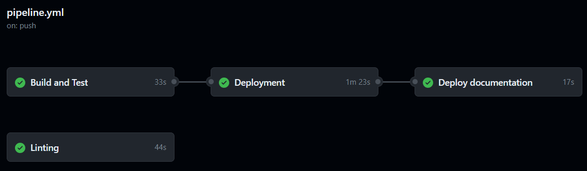

# Pipeline

## Build Pipeline

 

The Build Pipeline is executed, if something is pushed to main or on a merge Request.

### Building Stage

The building stage builds the Backend and executes all tests. If there are failures, the pipeline fails and **should not be merged in main**.

### Sonarqube Stage

Currently not implemented, because there are Server related Sonarqube issues.

## Documentation Pipeline

This automatically deploys the Documentation website, as soon as something is pushed to main. 

The pipeline executes a bash script on the Server, to which to Github Actions connects to via ssh. In the script the current main branch is pulled and the docker container gets rebuild.