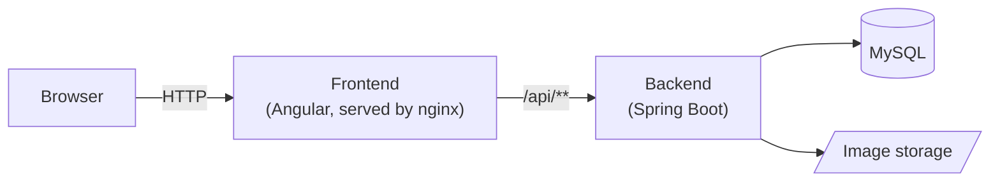

# Project Structure

The repository is separated into three parts:

| Directory         | Part          | Technology                                      |
|-------------------|---------------|-------------------------------------------------|
| `indexcards`      | Backend       | Spring Boot 2.7, Java 11, MySQL, Flyway         |
| `indexcards-ui`   | Frontend      | Angular 22, Angular Material, ngx-translate     |
| `indexcards-docu` | Documentation | MkDocs with the Material theme                  |

Additionally there are:

- `docker-compose.yml` — starts database, backend and frontend for the [deployment](operations/deployment.md),
- `.github/workflows/pipeline.yml` — the [pipeline](pipeline.md),
- `scripts/bump-version.sh` — sets the version of backend and frontend (see [Getting Started](development/getting-started.md#versioning)).

## Backend

The backend is a Spring Boot REST API in the package `com.x7ubi.indexcards`. It handles authentication with JWTs,
stores users, projects and index cards in MySQL and stores uploaded images on disk. See [Backend](development/backend.md).

## Frontend

The frontend is an Angular single page application with standalone components and Angular Material. In production it
is served by nginx, which also forwards `/api/` requests to the backend. See [Frontend](development/frontend.md).

## Documentation

The documentation is written in Markdown under `indexcards-docu/docs` and generated into a website by MkDocs. It is
published to [documentation.indexcards.7ubi.de](https://documentation.indexcards.7ubi.de/) by the
[pipeline](pipeline.md#deploy-documentation).
