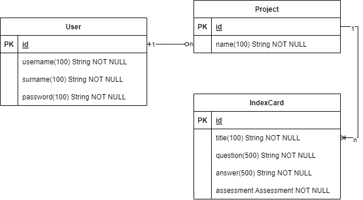

# Database

This site is going to showcase the Database.

## ER-Diagram

## Implementation

The implementation of these models can be found under `indexcards/src/main/java/com/x7ubi/indexcards/models`. 

The Model `IndexCard` has the attribute assessment of type Assessment. Assessment is a enumerate that can be either `UNRATED`, `BAD`, `OK` or `GOOD`. This will later be used to determent when the index card should be asked again.